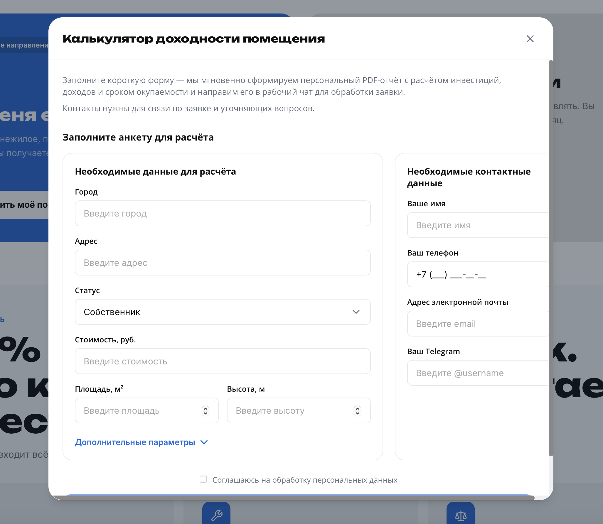
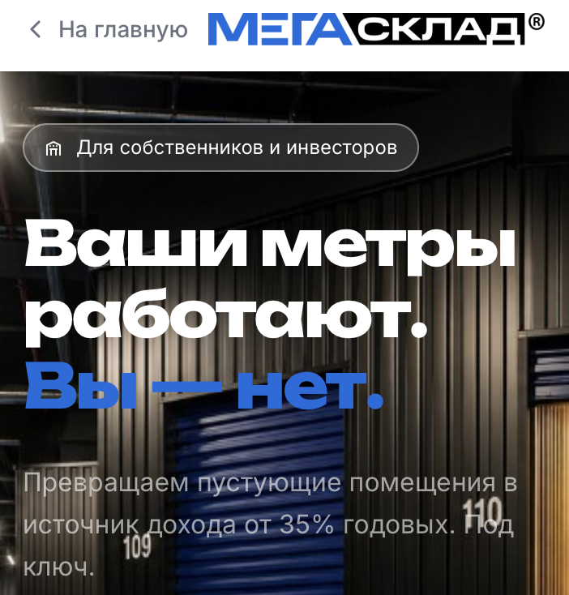
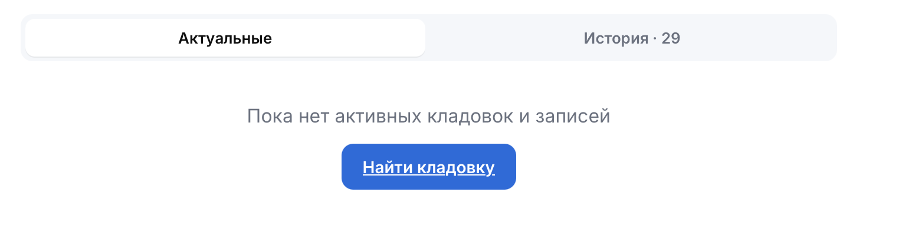
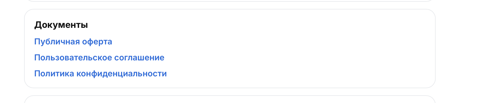
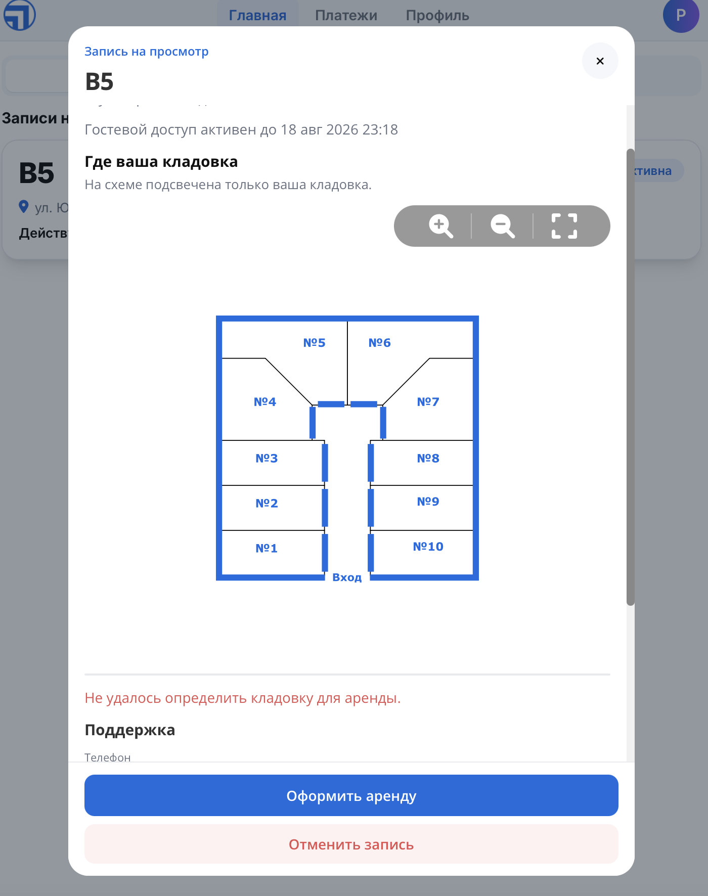
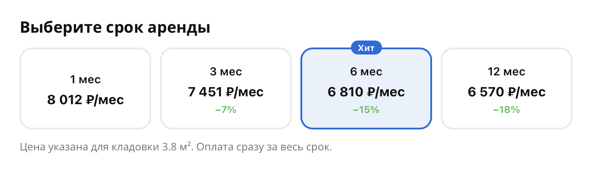

# Обзор сайта: informally-fearless-cobra.cloudpub.ru

**Проект:** МегаСклад — управление складскими ячейками
**Дата обзора:** 2026-08-17
**URL:** https://informally-fearless-cobra.cloudpub.ru/

---

## Список проблем

### 1. Раздел "О нас" — ОТСУТСТВУЕТ

**Проблема:** На сайте нет страницы "О нас" / "О компании".

**Почему это важно:**
- Для B2B/SaaS сервиса доверие критично
- Пользователь хочет знать: кто стоит за сервисом, сколько лет на рынке, какие гарантии
- Отсутствие информации о компании снижает конверсию
- Юридическим лицам нужна информация для бухгалтерии и compliance

**Рекомендации:**
1. Добавить страницу `/about` с:
   - Историей компании
   - Миссией и ценностями
   - Командой (фото, должности)
   - Достижениями (количество складов, клиентов, лет на рынке)
   - Контактами (адрес, телефон, email)
   - Лицензиями/сертификатами

2. Ссылку на "О нас" разместить:
   - В футере (обязательно)
   - В хедере (желательно)
   - В лендинге (в секции "Доверие" или "О нас")

---

### 2. Навигация — ЕСТЬ ПРОБЛЕМЫ

**Замечания:**
- Нет явной ссылки "О компании" в навигации
- Нет ссылки "Контакты" в хедере
- Для B2B важно показать: "Кто мы", "Как связаться", "Где находимся"

---

### 3. Доверие и социальное доказательство

**Чего не хватает:**
- Отзывов клиентов
- Кейсов (case studies)
- Логотипов партнёров/клиентов
- Сертификатов и лицензий
- Статистики (сколько складов, клиентов, лет на рынке)

---

### 4. Конверсионная воронка

**Проблемы:**
- Нет четкого CTA "Связаться с нами" на лендинге
- Нет формы обратной связи для вопросов
- Нет онлайн-чата
- Нет номера телефона в шапке

**Рекомендации:**
- Добавить CTA "Получить консультацию" или "Связаться с нами"
- Добавить форму обратной связи или онлайн-чат
- Показать номер телефона в хедере (для B2B это важно)

---

### 5. 🔴 БАГ: Форма "Калькулятор доходности помещения" — кривое отображение

**Приоритет:** 🔴 Высокий (критичный баг)

**Описание:**
Форма "Калькулятор доходности помещения" (модальное окно) отображается некорректно. Левая и правая колонки формы наезжают друг на друга, элементы перекрываются.



**Что видно на скриншоте:**
- Две колонки ("Необходимые данные для расчёта" и "Необходимые контактные данные") отображаются в одну строку
- Поля формы сжаты и перекрываются
- На мобильном/планшете форма может быть полностью нечитаемой
- Чекбокс "Соглашаюсь на обработку персональных данных" внизу модалки, может быть скрыт

**Возможные причины:**
1. Отсутствие адаптивных брейкпоинтов для модального окна
2. Фиксированная ширина колонок без `flex-wrap` или `grid`
3. Конфликт стилей между Tailwind и кастомными стилями модалки

**Рекомендации:**
1. Добавить медиа-запросы для модального окна:
   - На мобильных (< 768px) — одна колонка, поля друг под другом
   - На планшетах (768-1024px) — адаптивная ширина
   - На десктопах (> 1024px) — две колонки

2. Использовать CSS Grid или Flexbox с `flex-wrap: wrap`

3. Проверить модальное окно на всех размерах экрана:
   - 320px (iPhone SE)
   - 375px (iPhone 12)
   - 768px (iPad)
   - 1024px (iPad Pro)
   - 1440px (десктоп)

---

### 6. 🔴 БАГ: Чекбокс согласия — нет ссылки на политику конфиденциальности

**Приоритет:** 🔴 Высокий (юридическая необходимость)

**Описание:**
Чекбокс "Соглашаюсь на обработку персональных данных" не содержит ссылки на документ политики обработки персональных данных.

**Почему это критично:**
- По 152-ФЗ "О персональных данных" обязаны указывать ссылку на политику
- Пользователь не может ознакомиться с условиями обработки своих данных
- Это нарушение закона, которое может привести к штрафам
- Снижает доверие пользователей

**Текущее поведение:**
```
☑ Соглашаюсь на обработку персональных данных
```

**Должно быть:**
```
☑ Соглашаюсь на обработку персональных данных в соответствии с Политикой конфиденциальности
```
Где "Политикой конфиденциальности" — кликабельная ссылка на `/privacy-policy/`

**Рекомендация:**
Добавить гиперссылку на существующий документ `/privacy-policy/` прямо в текст чекбокса.

---

### 7. 🔴 БАГ: Ошибка валидации — непонятно в каком поле

**Приоритет:** 🔴 Высокий (UX-проблема)

**Описание:**
При заполнении формы калькулятора появляется ошибка "Убедитесь, что вы ввели не более 5 цифр", но непонятно к какому полю она относится.

**Текущее поведение:**
- Ошибка отображается внизу формы
- Нет привязки к конкретному полю
- Непонятно: это поле "Стоимость", "Площадь" или "Высота"?

**Рекомендации:**
1. Показывать ошибку **под конкретным полем**, а не внизу формы
2. Подсвечивать проблемное поле (красная рамка)
3. Уточнить текст ошибки: "Стоимость: не более 5 цифр" или "Площадь: не более 5 цифр"

---

### 8. 🟡 UX: На мобильном неудобно — нет бургер-меню

**Приоритет:** 🟡 Средний (UX-проблема)

**Описание:**
На мобильных устройствах отсутствует бургер-меню. Чтобы перейти в другой раздел, приходится каждый раз возвращаться на главную страницу.



**Проблема:**
- На десктопе — полная навигация в хедере
- На мобильном — навигация скрыта, нет бургер-меню
- Пользователь вынужден жать "Назад" или возвращаться на главную

**Рекомендации:**
1. Добавить бургер-меню (☰) на мобильных экранах (< 768px)
2. В бургер-меню разместить:
   - Основные разделы (Главная, Карта, Партнёры)
   - Ссылки на юридические документы
   - Кнопку "Связаться с нами"
   - Если авторизован — ссылки на ЛК

---

### 9. 🟡 UX: Лишняя ссылка на кнопке "Рассчитать доходность"

**Приоритет:** 🟡 Средний

**Описание:**
Кнопка "Рассчитать доходность" содержит ссылку (.href), хотя должна просто открывать модальное окно.



**Проблемы:**
1. При клике происходит переход по ссылке + открытие модалки
2. Кнопка может выглядеть как ссылка (подчёркнутый текст)
3. Нарушается семантика: кнопка ≠ ссылка

**Должно быть:**
```html
<button type="button" @click="openModal">Рассчитать доходность</button>
```

---

### 10. 🔴 UX: С карты нельзя вернуться в ЛК

**Приоритет:** 🔴 Высокий

**Описание:**
При переходе из личного кабинета на карту складов, пользователь не может вернуться обратно в ЛК. Нет кнопки "Назад" или ссылки на ЛК.

**Проблема:**
- Пользователь попадает на карту и "застревает" там
- Нет визуальной связи с ЛК
- Приходится использовать кнопку "Назад" браузера или заново входить

**Рекомендации:**
1. Добавить кнопку "← Вернуться в личный кабинет" в хедере карты
2. Или показывать хедер ЛК на странице карты
3. Добавить хлебные крошки: `ЛК → Моё хранилище → Карта`

---

### 11. 🟡 UX: Визуал карты отличается от остального сайта

**Приоритет:** 🟡 Средний

**Описание:**
Страница карты / просмотра склада визуально отличается от остального сайта. Как будто это отдельное приложение, а не часть МегаСклада.



**Проблема:**
- Другой стиль хедера
- Другие цвета / шрифты
- Нет логотипа МегаСклада
- Пользователь думает, что попал на другой сайт

**Рекомендации:**
1. Унифицировать дизайн с основным сайтом
2. Сохранить хедер МегаСклада
3. Использовать единую цветовую схему и типографику

---

### 12. 🔴 UX: После перехода нельзя вернуться в ЛК

**Приоритет:** 🔴 Высокий

**Описание:**
После просмотра информации о складе/ячейке пользователь не может легко вернуться в личный кабинет.

**Проблема:**
- Нет кнопки "Вернуться в ЛК"
- Нет навигации обратно
- Пользователь теряется

**Рекомендации:**
1. Добавить явную кнопку "← В личный кабинет"
2. Сохранять состояние ЛК в history
3. Добавить хлебные крошки

---

### 13. 🔴 UX: Кнопка "Оформить аренду" не работает

**Приоритет:** 🔴 Высокий

**Описание:**
На странице есть кнопка "Оформить аренду", но она не нажимается. С точки зрения пользователя — тупик, непонятно что делать.



**Проблема:**
- Кнопка визуально активная, но не кликабельная
- Нет подсказки почему она не работает
- Нет альтернативного действия

**Возможные причины:**
1. Кнопка заблокирована до заполнения обязательных полей
2. Баг в JavaScript
3. Кнопка показывается, но не должна (отладочный режим)

**Рекомендации:**
1. Если кнопка заблокирована — показать подсказку: "Заполните все поля для аренды"
2. Затемнить кнопку и добавить тултип
3. Или не показывать кнопку до готовности

---

### 14. 🟡 UX: Выбор периода — неинтуитивный дизайн

**Приоритет:** 🟡 Средний

**Описание:**
Плашки с выбором периода (6 мес, 1 год и т.д.) выглядят как обычные элементы, не акцентируется что это именно выбор.



**Проблема:**
- Плашки не выделяются как интерактивные элементы
- Непонятно что это кнопки, а не просто текст
- Нет визуального фокуса на выбранном варианте

**Рекомендации:**
1. Сделать плашки как кнопки с рамкой и hover-эффектом
2. Выбранный вариант — выделить цветом / фоном
3. Добавить заголовок "Выберите срок аренды"
4. Использовать radio-кнопки или toggle-группу

---

### 15. 🔴 БАГ: Платёж по СБП не работает

**Приоритет:** 🔴 Критичный

**Описание:**
При попытке оплаты через СБП выдаёт ошибку. Подписка не создаётся.

**Текст ошибки:**
```
Ошибка при создании подписки: {
  'type': 'error',
  'id': '01a01162-d251-743c-8eed-26feaabbd7d9',
  'description': "This store can't make recurring payments. Contact the YooMoney manager to learn more",
  'code': 'forbidden'
}
```

**Причина:**
Магазин в ЮKassa (YooMoney) не подключил рекуррентные платежи. СБП работает только с разовыми платежами, а подписка требует рекуррентных.

**Рекомендации:**
1. Связаться с менеджером ЮKassa и подключить рекуррентные платежи
2. Либо отключить СБП как способ оплаты для подписок
3. Либо разбить подписку на разовые платежи (не рекуррентные)
4. Показать пользователю понятное сообщение: "Оплата по СБП временно недоступна. Выберите другой способ оплаты"

---

## Сводная таблица

| # | Проблема | Приоритет |
|---|----------|-----------|
| 1 | Нет страницы "О нас" | ❌ |
| 2 | Проблемы навигации | ❌ |
| 3 | Нет социального доказательства | ❌ |
| 4 | Слабая конверсионная воронка | ❌ |
| 5 | Форма калькулятора — кривое отображение | 🔴 |
| 6 | Чекбокс — нет ссылки на политику | 🔴 |
| 7 | Ошибка валидации — непонятно где | 🔴 |
| 8 | Мобильная навигация — нет бургер-меню | 🟡 |
| 9 | Кнопка "Рассчитать" — лишняя ссылка | 🟡 |
| 10 | С карты нельзя вернуться в ЛК | 🔴 |
| 11 | Визуал карты отличается от сайта | 🟡 |
| 12 | Нет возврата в ЛК после перехода | 🔴 |
| 13 | Кнопка "Оформить аренду" не работает | 🔴 |
| 14 | Выбор периода — неинтуитивный дизайн | 🟡 |
| 15 | Оплата по СБП не работает | 🔴 Критичный |

---

## Приоритеты для доработки

1. 🔴 **Критичный:** Исправить оплату по СБП (ЮKassa рекуррентные платежи)
2. 🔴 **Высокий:** Исправить баг с формой калькулятора (кривое отображение)
3. 🔴 **Высокий:** Добавить ссылку на политику конфиденциальности в чекбокс согласия
4. 🔴 **Высокий:** Исправить валидацию — показывать ошибку под конкретным полем
5. 🔴 **Высокий:** Добавить возврат в ЛК со страницы карты
6. 🔴 **Высокий:** Исправить кнопку "Оформить аренду" (сделать кликабельной или скрыть)
7. 🟡 **Средний:** Добавить бургер-меню на мобильные устройства
8. 🟡 **Средний:** Убрать ссылку с кнопки "Рассчитать доходность"
9. 🟡 **Средний:** Унифицировать визуал карты с основным сайтом
10. 🟡 **Средний:** Улучшить дизайн выбора периода (плашки → кнопки)
11. **Высокий:** Добавить страницу "О нас" (`/about`)
12. **Высокий:** Добавить страницу "Контакты" (`/contacts`)
13. **Средний:** Добавить отзывы клиентов на лендинг
14. **Средний:** Добавить CTA "Связаться с нами" в хедер
15. **Низкий:** Добавить FAQ
16. **Низкий:** Добавить блог с статьями о хранении

---

## Скриншоты багов

### Баг #5: Форма калькулятора доходности

- **Описание:** Колонки формы наезжают друг на друга, поля перекрываются
- **Условие воспроизведения:** Открыть модальное окно "Калькулятор доходности помещения" на экране < 1024px

### Баг #8: Мобильная навигация — нет бургер-меню

- **Описание:** На мобильном нет бургер-меню, приходится каждый раз возвращаться на главную для навигации

### Баг #9: Лишняя ссылка на кнопке "Рассчитать доходность"

- **Описание:** Кнопка "Рассчитать доходность" содержит ссылку (.href), хотя должна просто открывать модальное окно

### Баг #11: Визуал карты отличается от сайта

- **Описание:** Страница карты визуально отличается от основного сайта

### Баг #13: Кнопка "Оформить аренду" не работает

- **Описание:** Кнопка визуально активная, но не нажимается, нет подсказки

### Баг #14: Выбор периода — неинтуитивный дизайн

- **Описание:** Плашки с периодами не выделяются как интерактивные элементы

### Баг #15: Оплата по СБП не работает
- **Описание:** ЮKassa не подключила рекуррентные платежи для СБП
- **Ошибка:** `"This store can't make recurring payments"`
