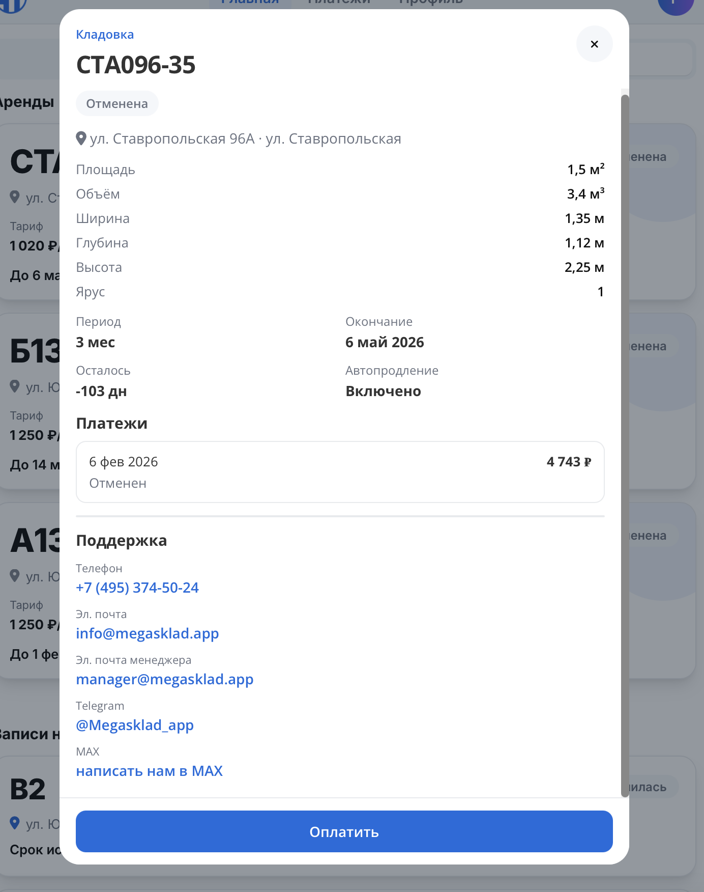

# Обзор сайта: informally-fearless-cobra.cloudpub.ru

**Проект:** МегаСклад — управление складскими ячейками
**Дата обзора:** 2026-08-17
**URL:** https://informally-fearless-cobra.cloudpub.ru/

---

## Список проблем

### 1. 🔴 БАГ: Форма калькулятора — кривое отображение

Колонки формы наезжают друг на друга, поля перекрываются.


**Причина:** Отсутствие адаптивных брейкпоинтов для модального окна.

**Решение:** Добавить CSS Grid / Flexbox с `flex-wrap`, медиа-запросы для мобильных.

---

### 2. 🔴 БАГ: Чекбокс — нет ссылки на политику конфиденциальности

Чекбокс "Соглашаюсь на обработку персональных данных" не содержит ссылки на политику. Это нарушение 152-ФЗ.

**Должно быть:**
```
☑ Соглашаюсь на обработку персональных данных в соответствии с Политикой конфиденциальности
```
Где "Политикой конфиденциальности" — ссылка на `/privacy-policy/`.

---

### 3. 🔴 БАГ: Ошибка валидации — непонятно в каком поле

Ошибка "Убедитесь, что вы ввели не более 5 цифр" отображается внизу формы, без привязки к конкретному полю.

**Решение:** Показывать ошибку под проблемным полем, подсвечивать его красной рамкой.

---

### 4. 🔴 БАГ: Кнопка "Оформить аренду" не работает

Кнопка визуально активная, но не кликабельная. Нет подсказки почему.


**Решение:** Если кнопка заблокирована — показать тултип "Заполните все поля". Или не показывать до готовности.

---

### 5. 🔴 БАГ: Оплата по СБП не работает

ЮKassa не подключила рекуррентные платежи. Ошибка:
```
"This store can't make recurring payments. Contact the YooMoney manager to learn more"
```

**Решение:** Подключить рекуррентные платежи в ЮKassa или отключить СБП для подписок.

---

### 6. 🔴 БАГ: 500 ошибка при создании подписки

При оплате или загрузке подписок в ЛК — 500 ошибка сервера.

```
[Error] Failed to load resource: 500 (subscriptions)
[Error] Payment creation failed (RentModal.vue:267)
```

**Решение:** Проверить логи бэкенда, добавить обработку ошибки на фронтенде.

---

### 7. 🟡 UX: На мобильном нет бургер-меню

Чтобы перейти в другой раздел, приходится возвращаться на главную.


**Решение:** Добавить бургер-меню (☰) на экранах < 768px с основными разделами и ссылкой на ЛК.

---

### 8. 🟡 UX: Лишняя ссылка на кнопке "Рассчитать доходность"

Кнопка содержит `.href`, хотя должна просто открывать модалку. Нарушается семантика.


**Решение:** Заменить на `<button @click="openModal">`.

---

### 9. 🟡 UX: Модалка отличается от визуала сайта

Модальное окно визуально сильно отличается от остального сайта.



**Решение:** Унифицировать дизайн модалки с основным сайтом.

---

### 10. 🟡 UX: Выбор периода — неинтуитивный дизайн

Плашки с периодами (6 мес, 1 год) не выделяются как интерактивные элементы.


**Решение:** Сделать кнопки с рамкой, hover-эффектом, выделить выбранный вариант.

---

### 11. ❌ ОТСУТСТВУЕТ: Страница "О нас"

Для B2B/SaaS критично показать: кто стоит за сервисом, сколько лет на рынке, гарантии.

**Решение:** Добавить `/about` с историей, командой, достижениями, лицензиями.

---

### 12. ❌ ОТСУТСТВУЕТ: Страница "Контакты"

Нет явных контактов в хедере или отдельной страницы.

**Решение:** Добавить `/contacts` с адресом, телефоном, email, формой обратной связи.

---

### 13. ❌ ОТСУТСТВУЕТ: Социальное доказательство

Нет отзывов клиентов, кейсов, логотипов партнёров, статистики.

**Решение:** Добавить отзывы, кейсы, счётчики ("1000+ клиентов", "50+ складов").

---

### 14. ❌ ОТСУТСТВУЕТ: Конверсионная воронка

Нет CTA "Связаться с нами", нет чата, нет номера телефона в шапке.

**Решение:** Добавить CTA, форму обратной связи, номер телефона в хедере.

---

## Сводная таблица

| # | Проблема | Приоритет |
|---|----------|-----------|
| 1 | Форма калькулятора — кривое отображение | 🔴 |
| 2 | Чекбокс — нет ссылки на политику | 🔴 |
| 3 | Ошибка валидации — непонятно где | 🔴 |
| 4 | Кнопка "Оформить аренду" не работает | 🔴 |
| 5 | Оплата по СБП не работает | 🔴 |
| 6 | 500 ошибка при создании подписки | 🔴 |
| 7 | Мобильная навигация — нет бургер-меню | 🟡 |
| 8 | Кнопка "Рассчитать" — лишняя ссылка | 🟡 |
| 9 | Модалка отличается от визуала сайта | 🟡 |
| 10 | Выбор периода — неинтуитивный дизайн | 🟡 |
| 11 | Нет страницы "О нас" | ❌ |
| 12 | Нет страницы "Контакты" | ❌ |
| 13 | Нет социального доказательства | ❌ |
| 14 | Слабая конверсионная воронка | ❌ |
